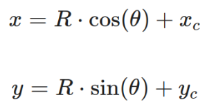
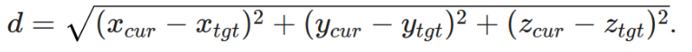

# MAVROS Offboard Circular Trajectory Control

# MAVROS Offboard 圆形轨迹控制

## Overview / 概述
This script implements an autonomous circular flight path for a drone using **MAVROS** and **PX4/ArduPilot** flight stacks. It generates a parametric trajectory and controls the vehicle in **OFFBOARD** mode, utilizing position setpoints.

该脚本基于 **MAVROS** 和 **PX4/ArduPilot** 飞控协议栈实现无人机自主圆形轨迹飞行。它通过生成参数化轨迹点，并在 **OFFBOARD** 模式下利用位置设定点（Setpoint）控制飞行器移动。

## Features / 功能特性
* **Trajectory Generation**: Automatically generates a smooth circular path (100 waypoints) using `numpy`.
    * **轨迹生成**：使用 `numpy` 自动生成包含 100 个航点的平滑圆形路径。
* **Auto-Arm & Mode Switch**: Automatically switches the FCU to `OFFBOARD` mode and arms the vehicle.
    * **自动解锁与模式切换**：自动请求 FCU 切换至 `OFFBOARD` 模式并解锁车辆。
* **Waypoint Navigation Logic**: Uses Euclidean distance checks to determine waypoint arrival and sequences the next target.
    * **航点导航逻辑**：利用欧几里得距离判断是否到达当前航点，并自动切换至下一目标。
* **Continuous Looping**: The drone flies the circular path continuously.
    * **持续循环**：飞行器将无限循环执行该圆形航线。

## Implementation Details / 实现思路

### 1. Trajectory Initialization (轨迹初始化)
Calculates waypoint coordinates based on polar coordinates converted to Cartesian:
根据极坐标转直角坐标公式计算航点：


* **Radius (R)**: 5.0m
* **Altitude (z)**: 2.0m
* **Resolution**: 100 points/circle

### 2. Connection & Pre-streaming (连接与预发送)
* Waits for MAVROS connection to the FCU.
* Publishes setpoints for a short duration *before* requesting OFFBOARD mode. This is a safety requirement for the PX4 flight stack to reject mode switch denial.
* 等待 MAVROS 与 FCU 建立连接。
* 在请求 OFFBOARD 模式*之前*预先发送一段时间的设定点。这是 PX4 协议栈防止模式切换被拒绝的安全机制。

### 3. State Machine Loop (状态机循环)
Runs at **20Hz**. Inside the loop:
运行频率为 **20Hz**。循环逻辑如下：
* **Monitor State**: Re-requests `OFFBOARD` mode or `ARM` command every 5 seconds if not already active.
    * **状态监控**：如果尚未激活，每隔 5 秒重发一次 `OFFBOARD` 模式或 `ARM` 解锁指令。
* **Position Control**:
    * Subscribes to `/mavros/local_position/pose`.
    * Calculates distance error: 
    * **Threshold Check**: If $d < 0.3m$ (`TOLERANCE`), updates the target index (`current_aim_index`).
    * **位置控制**：
        * 订阅 `/mavros/local_position/pose` 获取当前位姿。
        * 计算距离误差。
        * **阈值检测**：若距离小于 0.3m (`TOLERANCE`)，则更新目标索引 (`current_aim_index`)。

## Dependencies / 依赖
* ROS 1 (Noetic recommended)
* MAVROS
* Python 3 packages: `numpy`, `rospy`

## Usage / 使用方法

1.  Start PX4 SITL and MAVROS (or connect to real hardware):
    启动 PX4 SITL 和 MAVROS（或连接真实硬件）：
    ```bash
    roslaunch px4 mavros_posix_sitl.launch
    ```

2.  Run the control node:
    运行控制节点：
    ```bash
    chmod +x circle.py
    roslaunch launch/circle.launch
    ```